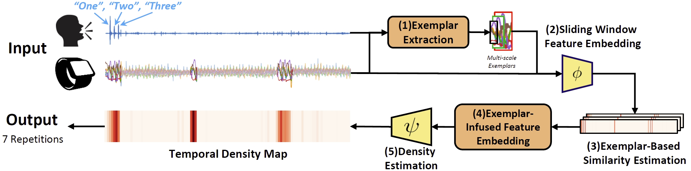

# **[AAAI24] Count What You Want: Exemplar Identification and Few-shot Counting of Human Actions in the Wild**

[<span style="font-size: larger;">Project Page</span>](https://yifehuang97.github.io/ExRAC.github.io/)

[](https://colab.research.google.com/drive/1MYmKte_denL7bBffHE1T8S_NGfINauLG#scrollTo=WLQ5yeSIojfw)


Our work uses audio cues as exemplar to perform few-shot repetitive action counting in the wild on smartwatch data.



## Contact
If you have any issues, please contact yifehuang@cs.stonybrook.edu

## Environment set up
```
conda create -n ExRac python=3.8.8
conda activate ExRac
git clone https://github.com/Yifehuang97/ExRAC.git
cd ExRAC
pip install -r requirements.txt
pip install torch==1.12.1+cu116 torchvision==0.13.1+cu116 torchaudio==0.12.1 --extra-index-url https://download.pytorch.org/whl/cu116
conda install cudatoolkit=10.1.243
# Cython Extension
cd Utils
python setup.py build_ext --inplace
```

## Data and Checkpoints

### Download with wget
```
# Checkpoints
wget --load-cookies /tmp/cookies.txt "https://docs.google.com/uc?export=download&confirm=$(wget --quiet --save-cookies /tmp/cookies.txt --keep-session-cookies --no-check-certificate 'https://docs.google.com/uc?export=download&id=1pBbxUTlmMAlYDkXJ-RYBoeezSNjIsJZG' -O- | sed -rn 's/.*confirm=([0-9A-Za-z_]+).*/\1\n/p')&id=1pBbxUTlmMAlYDkXJ-RYBoeezSNjIsJZG" -O Checkpoints.zip && rm -rf /tmp/cookies.txt
```

```
# DWC_v1
wget --load-cookies /tmp/cookies.txt "https://docs.google.com/uc?export=download&confirm=$(wget --quiet --save-cookies /tmp/cookies.txt --keep-session-cookies --no-check-certificate 'https://docs.google.com/uc?export=download&id=1P6CpwZszTtGOMQx0IaPu1VXR1GeboI7O' -O- | sed -rn 's/.*confirm=([0-9A-Za-z_]+).*/\1\n/p')&id=1P6CpwZszTtGOMQx0IaPu1VXR1GeboI7O" -O DWC_v1.zip && rm -rf /tmp/cookies.txt
```

### Download from Google Drive

[Checkpoints](https://drive.google.com/file/d/1pBbxUTlmMAlYDkXJ-RYBoeezSNjIsJZG/view?usp=drive_link)

[DWC_v1](https://drive.google.com/file/d/1P6CpwZszTtGOMQx0IaPu1VXR1GeboI7O/view?usp=drive_link)


## Experiment Reproduction

### Evaluate

[](https://colab.research.google.com/drive/1MYmKte_denL7bBffHE1T8S_NGfINauLG#scrollTo=WLQ5yeSIojfw)
```
python eval.py --is_local --data_path ./Data/DWC_v1
```

### Training

```
python train.py --split_type action_plus --is_local --config vanilla --pretrain --pretrain_epochs 30 --gpu_id 0
```

### Generate Pretrain Data

```
cd DataSyn
python Fragment.py --save_path ./syn_data/fragments
python Syn.py --save_path ./syn_data/data --fragments_path ./syn_data/fragments --sample_num 6830
```
